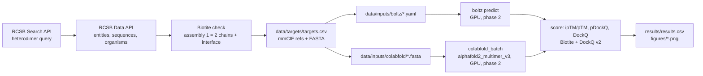

# cofold-bench

**Boltz-2 (cofolding) vs AlphaFold2-Multimer v3 (ColabFold) on post-training-cutoff protein–protein heterodimers**, scored with ipTM/pTM, pDockQ and DockQ against experimental PDB references. Structure handling with [Biotite](https://www.biotite-python.org/).

> **Status: phase 1 complete (CPU only) — Results: pending phase 2 (GPU runs).**
> Targets are selected and downloaded, predictor inputs are written, the scoring code is unit-tested on the
> reference structures (DockQ of every reference against itself = 1.0), and `run_all.sh` runs end-to-end
> with the two GPU stages guarded. No prediction has been run yet, so there are **no benchmark numbers in
> this repository**; the figures below will be produced by `python -m cofoldbench.plot` after phase 2.

## Results

| figure | status |
|---|---|
| `figures/dockq_scatter.png` — DockQ Boltz-2 vs AF2-Multimer (top-1 model), CAPRI bands | pending phase 2 |
| `figures/dockq_bars.png` — per-target DockQ, both predictors | pending phase 2 |
| `figures/iptm_vs_dockq.png` — ipTM and pDockQ vs DockQ, Spearman ρ per predictor | pending phase 2 |
| `results/results.csv`, `results/summary.csv` | pending phase 2 |

## What / why

Cofolding models (AlphaFold3-class; here the open-weights **Boltz-2**) and the earlier **AlphaFold2-Multimer**
both predict complexes from sequence, but benchmarks usually reuse targets that overlap the training data.
This repository is a small, fully scripted benchmark on **protein–protein heterodimers released to the PDB
after 2024-06-01**, i.e. after the documented training cutoffs of both predictors, answering three questions:

1. Does Boltz-2 dock heterodimers better than AF2-Multimer v3 (DockQ, CAPRI classes) on unseen targets?
2. How well do the models' own confidences (ipTM, pDockQ) track the actual DockQ?
3. Are the failures shared (hard targets) or predictor-specific?

Everything — target selection, downloads, input generation, scoring, figures — is reproducible from
`config.yaml` with one command, and the data footprint is small (`data/` ≈ 13 MB).

## Pipeline



Stages of `run_all.sh`: `select | download | inputs | test | predict-boltz | predict-af2 | score | report`.
The two `predict-*` stages only run when the predictor is installed, a GPU is visible **and** `RUN_GPU=1` is set;
otherwise they print `SKIPPED`. `score` and `report` are no-ops (with a message) until predictions exist.

## Targets (22 = 16 primary + 4 backup + 2 antibody subset)

Selected on 2026-09-04 with the RCSB Search API (1023 hits for the raw query) and the Data API; the exact
JSON query, all filter thresholds and the per-stage counts are in [`data/targets/QUERY.md`](data/targets/QUERY.md);
every examined entry with its pass/fail reason is in `data/targets/candidates.csv`.

Criteria: exactly two protein polymer entities, one copy of each in the asymmetric unit, no nucleic acids;
X-ray or cryo-EM with resolution ≤ 2.8 Å (all 22 selected happen to be X-ray, 0.96–2.60 Å); canonical total
length 150–550 aa and each chain ≥ 40 aa (no peptides); released strictly after 2024-06-01; the two chains
are not (pseudo-)homodimers (different descriptions, global identity < 90 %); antibody-like entries (keywords
in title/descriptions **or** an Ig variable-domain sequence signature) go to a labelled `antibody` subset,
Fab/Fv heavy–light pairs without antigen are dropped; one entry per description pair; finally Biotite builds
biological assembly 1 and requires exactly two protein chains with ≥ 20 residue pairs within 5 Å.
Candidates are visited in a seeded random order (seed 2024) so the set is not biased toward the earliest deposits.

| # | PDB | role | chain A (entity 1) | chain B (entity 2) | len A+B | res. (Å) | released | organism(s) |
|---|---|---|---|---|---|---|---|---|
| 1 | [9ASS](https://www.rcsb.org/structure/9ASS) | primary | Neutrophil elastase | Extracellular Adherence Protein | 218+108=326 | 1.75 | 2024-06-12 | Homo sapiens / Staphylococcus aureus… |
| 2 | [8RO8](https://www.rcsb.org/structure/8RO8) | primary | Structural maintenance of chromosomes… | 64-kDa C-terminal product | 456+81=537 | 1.90 | 2024-09-11 | Homo sapiens |
| 3 | [9E9G](https://www.rcsb.org/structure/9E9G) | primary | TGF-beta receptor type-2 | Transforming growth factor beta mimic… | 118+92=210 | 1.40 | 2025-01-22 | Homo sapiens / Heligmosomoides polyg… |
| 4 | [9RS3](https://www.rcsb.org/structure/9RS3) | primary | N6-adenosine-methyltransferase cataly… | N(6)-adenosine-methyltransferase non-… | 228+307=535 | 2.11 | 2026-03-18 | Homo sapiens |
| 5 | [9YGS](https://www.rcsb.org/structure/9YGS) | primary | Isoform 2B of GTPase KRas | RAF proto-oncogene serine/threonine-p… | 171+80=251 | 1.68 | 2026-05-20 | Homo sapiens |
| 6 | [9IRO](https://www.rcsb.org/structure/9IRO) | primary | Uracil-DNA glycosylase | Staphylococcus epidermidis uracil-DNA… | 226+132=358 | 2.18 | 2025-07-16 | Staphylococcus aureus / Staphylococcus epider… |
| 7 | [9Q0B](https://www.rcsb.org/structure/9Q0B) | primary | Beta-lactamase CTX-M-15 | Beta-lactamase inhibitory protein | 261+164=425 | 1.58 | 2025-11-05 | Escherichia coli / Streptomyces clavulig… |
| 8 | [8CM0](https://www.rcsb.org/structure/8CM0) | primary | Immunity protein RhsI2 | Rhs-family protein | 162+162=324 | 2.17 | 2024-08-28 | Serratia marcescens |
| 9 | [9J9W](https://www.rcsb.org/structure/9J9W) | primary | TsiN | TseN | 158+156=314 | 2.60 | 2025-10-22 | Paracidovorax citrulli AAC00-1 |
| 10 | [9SPR](https://www.rcsb.org/structure/9SPR) | primary | Cellular tumor antigen p53 | DARPin C10 | 202+126=328 | 1.66 | 2026-04-22 | Homo sapiens / synthetic construct |
| 11 | [9FL4](https://www.rcsb.org/structure/9FL4) | primary | Methyltransferase N6AMT1 | Multifunctional methyltransferase sub… | 203+126=329 | 1.70 | 2025-06-18 | Homo sapiens |
| 12 | [9O24](https://www.rcsb.org/structure/9O24) | primary | Heparanase 50 kDa subunit | Heparanase 8 kDa subunit | 384+74=458 | 2.60 | 2026-02-11 | Homo sapiens |
| 13 | [9HPX](https://www.rcsb.org/structure/9HPX) | primary | Periplasmic [Fe] hydrogenase large su… | Periplasmic [Fe] hydrogenase small su… | 397+88=485 | 0.96 | 2025-12-24 | Desulfovibrio desulfuricans |
| 14 | [9I5Y](https://www.rcsb.org/structure/9I5Y) | primary | Endoplasmic reticulum chaperone BiP | Cerebral dopamine neurotrophic factor | 381+61=442 | 1.50 | 2026-02-18 | Homo sapiens |
| 15 | [9OHL](https://www.rcsb.org/structure/9OHL) | primary | rRNA N(6)-adenosine-methyltransferase… | Multifunctional methyltransferase sub… | 209+125=334 | 1.29 | 2025-06-11 | Homo sapiens |
| 16 | [9D5P](https://www.rcsb.org/structure/9D5P) | primary | Integrin-linked protein kinase | Alpha-parvin | 271+129=400 | 1.50 | 2025-10-29 | Homo sapiens |
| 17 | [9S61](https://www.rcsb.org/structure/9S61) | backup | DBL8 | Aurora kinase A | 62+285=347 | 2.37 | 2026-07-22 | synthetic construct / Homo sapiens |
| 18 | [9FWR](https://www.rcsb.org/structure/9FWR) | backup | Non-structural protein 10 | Guanine-N7 methyltransferase nsp14 | 131+290=421 | 2.29 | 2025-07-09 | Severe acute respiratory syndrome coronavirus 2 |
| 19 | [9G0D](https://www.rcsb.org/structure/9G0D) | backup | [F-actin]-monooxygenase MICAL1 | Ras-related protein Rab-10 | 153+177=330 | 2.05 | 2025-07-02 | Homo sapiens |
| 20 | [9HMX](https://www.rcsb.org/structure/9HMX) | backup | Peptidoglycan endopeptidase RipA | Copper transporter MctB | 216+277=493 | 2.22 | 2025-07-30 | Mycobacterium tuberculosis H37Rv |
| 21 | [9EZV](https://www.rcsb.org/structure/9EZV) | antibody subset | V-set and immunoglobulin domain-conta… | single-domain antibody VHH_h2 | 127+134=261 | 1.45 | 2025-10-29 | Homo sapiens |
| 22 | [9UO0](https://www.rcsb.org/structure/9UO0) | antibody subset | Spike glycoprotein | Tnb165 | 214+129=343 | 2.50 | 2026-04-29 | Middle East respirato… / Homo sapiens |

Chain `A`/`B` in the predictor inputs are entity 1/entity 2; the reference chain ids (label and author) are in
`targets.csv`. Two remarks: 9O24 is the 50 + 8 kDa heterodimer produced by proteolytic processing of one
heparanase precursor (a heterodimer in the PDB sense, but the two chains come from one gene), and 9FL4 / 9OHL
share the partner TRM112 with different methyltransferases.

## Cutoff rationale

| model | training data cutoff | source |
|---|---|---|
| AlphaFold-Multimer v3 (AlphaFold v2.3.0 weights, `alphafold2_multimer_v3` in ColabFold) | PDB entries released before **2021-09-30** | DeepMind, [`docs/technical_note_v2.3.0.md`](https://github.com/google-deepmind/alphafold/blob/main/docs/technical_note_v2.3.0.md): "a new training cutoff of 2021-09-30" |
| Boltz-2 | PDB entries released before **2023-06-01** (validation set: 2023-06-01 to 2024-01-01) | Passaro et al. 2025, bioRxiv [10.1101/2025.06.14.659707](https://doi.org/10.1101/2025.06.14.659707), *Data* section and Appendix ("every PDB structure up to the training date cutoff of 06/01/2023") |

We require initial release **after 2024-06-01**, six months later than the newest date in either paper, so no
target structure was available to either model during training. Caveat (not controllable at this scale): close
homologues of a target *complex* may exist before the cutoff; the ColabFold MSA server and Boltz-2's MSA are
built from current sequence databases in both cases, so the comparison is fair between the two predictors but is
not a "no-homology" benchmark.

## Metrics

* **ipTM / pTM / pLDDT** — read from the predictors' own confidence files. Boltz-2:
  `confidence_<id>_model_k.json` (`protein_iptm`, `iptm`, `ptm`, `complex_plddt`, `confidence_score` = 0.8·pLDDT + 0.2·ipTM,
  used for ranking). ColabFold: `<id>_scores_rank_00k_alphafold2_multimer_v3_model_m_seed_00s.json` (`iptm`, `ptm`,
  per-residue `plddt`; ranked by 0.8·ipTM + 0.2·pTM).
* **pDockQ** — Bryant, Pozzati & Elofsson, *Nat Commun* 13:1265 (2022):
  pDockQ = 0.724 / (1 + exp(−0.052 (x − 152.611))) + 0.018 with x = ⟨pLDDT⟩<sub>interface</sub> · log10(N<sub>contacts</sub>),
  contacts = CB–CB (CA for Gly) pairs < 8 Å between chains. Implemented in `src/cofoldbench/pdockq.py`,
  pLDDT taken from the model's B-factor column (both predictors write 0–100; Boltz 2.2.1's writer multiplies by 100 — a 0–1 scale would be auto-detected).
* **DockQ** — [DockQ v2](https://github.com/bjornwallner/DockQ) (Mirabello & Wallner 2024) via its Python API
  (`load_PDB`, `run_on_all_native_interfaces`), both chain assignments tried and the best kept (= automatic mapping
  for two chains); CAPRI classes acceptable ≥ 0.23, medium ≥ 0.49, high ≥ 0.80. The native is biological
  assembly 1 of the RCSB mmCIF, protein heavy atoms only, built with `biotite.structure.io.pdbx.get_assembly`.

Tests (`pytest`, 17 tests): pDockQ on synthetic coordinates (sigmoid limits, contact counting, interface-pLDDT
averaging, monotonicity, pLDDT-scale detection); Biotite assembly/chain/contact utilities on the downloaded references; **DockQ of each
reference against itself = 1.0** (also with swapped model chains); parsers on synthetic Boltz-2/ColabFold outputs; an end-to-end `score` + `plot` run on synthetic predictions built from three references (DockQ = 1.0 for both predictors, figures written).

## Reproduce

```bash
# 1. environments (see environment.yml; ColabFold lives in its own env because of jax/cuda pins)
mamba env create -f environment.yml                      # env "cofold": biotite 1.6.0, DockQ 2.1.3, pandas, matplotlib, boltz 2.2.1
mamba create -n colabfold python=3.10 -y && \
  ~/miniforge3/envs/colabfold/bin/pip install "colabfold[alphafold]" "jax[cuda12]"   # env "colabfold" (colabfold 1.6.2 here)

# 2. everything that runs without a GPU (idempotent; targets.csv is not re-selected unless FORCE_SELECT=1)
./run_all.sh select download inputs test

# 3. phase 2 — GPU
RUN_GPU=1 ./run_all.sh predict-boltz predict-af2        # or scripts/run_boltz.sh 9ASS / scripts/run_colabfold.sh 9ASS
./run_all.sh score report                               # results/results.csv, figures/*.png
```

Predictor settings (all in `config.yaml`): Boltz-2 `--recycling_steps 3 --diffusion_samples 5 --sampling_steps 200
--use_msa_server --msa_pairing_strategy greedy --output_format mmcif --seed 42` (potentials off);
ColabFold `--model-type alphafold2_multimer_v3 --num-recycle 3 --num-models 5 --num-seeds 1 --msa-mode mmseqs2_uniref_env
--pair-mode unpaired_paired --rank multimer` (no Amber relax). Both scripts skip finished targets
(Boltz: `confidence_<id>_model_0.json` present; ColabFold: `<id>.done.txt`) and log to `results/raw/*/logs/`.

## Hardware

Local laptop: NVIDIA GeForce RTX 4060 Laptop GPU (8 GB), 16 CPU threads, 14 GB RAM. Phase 1 used CPU only.
The 150–550 aa window was chosen so that both predictors fit in 8 GB (Boltz-2 with `--max_parallel_samples 1`;
ColabFold with unified memory). Phase 2 timings will be recorded in `results/raw/*/logs`.

## Data provenance

* Structures and metadata: RCSB PDB ([Search API](https://search.rcsb.org/), [Data API](https://data.rcsb.org/),
  [files.rcsb.org](https://files.rcsb.org/)), retrieved 2026-09-04; `data/targets/cif/*.cif` are the unmodified
  RCSB mmCIF files (13 MB in total). Sequences in `data/targets/fasta` are the canonical entity sequences
  (`entity_poly.pdbx_seq_one_letter_code_can`), which may include expression tags (e.g. His-tags) present in the construct.
* MSAs (phase 2) come from the public ColabFold MMseqs2 server (`api.colabfold.com`) for both predictors.
* No prediction outputs are committed (`results/raw/` is git-ignored); aggregated CSVs and figures will be.

## Limitations

* **No results yet** — phase 1 only. Numbers appear here only after phase 2 runs on the listed hardware.
* 16 (+4 backup) targets is small; differences of a few DockQ units per target will not be significant. Backups
  exist for targets that fail (MSA server errors, OOM).
* "Post-cutoff" refers to the *structures*; homologous complexes may pre-date the cutoff (see above).
* Single seed / 5 models per predictor; ranking by each predictor's own confidence. Boltz-2 is run without
  inference-time potentials (`use_potentials: false`) to compare the raw models.
* The reference is biological assembly 1 as annotated by the depositors; for all 22 targets it equals the asymmetric unit (checked with Biotite: same chains and residue counts).
* Antibody–antigen complexes are a known-hard, separate class: only two are kept, clearly labelled, and are reported separately.

## Layout

```
config.yaml              all parameters (selection thresholds, predictor flags, pDockQ constants)
run_all.sh               single entry point with guarded stages
src/cofoldbench/         rcsb, select_targets, download, make_inputs, structure, pdockq, confidence, dockq_runner, score, plot
scripts/run_boltz.sh     Boltz-2 driver (resume-safe)          scripts/run_colabfold.sh   AF2-Multimer driver (resume-safe)
data/targets/            QUERY.md, targets.csv, candidates.csv, cif/, fasta/
data/inputs/             boltz/*.yaml, colabfold/*.fasta
tests/                   pytest suite (17 tests)
results/, figures/       filled in phase 2
```

## Citation

If you use this benchmark, please cite the tools it builds on:
Passaro et al., *Boltz-2* (bioRxiv 2025, 10.1101/2025.06.14.659707); Evans et al., *AlphaFold-Multimer*
(bioRxiv 2021, 10.1101/2021.10.04.463034); Mirdita et al., *ColabFold* (Nat Methods 2022); Bryant et al.,
pDockQ (Nat Commun 2022); Mirabello & Wallner, *DockQ v2* (Bioinformatics 2024); Kunzmann & Hamacher,
*Biotite* (BMC Bioinformatics 2018).

```
Shovkoplias O. (2026). cofold-bench: Boltz-2 vs AlphaFold2-Multimer on post-cutoff protein heterodimers.
https://github.com/oshovkoplias/cofold-bench (MIT)
```
