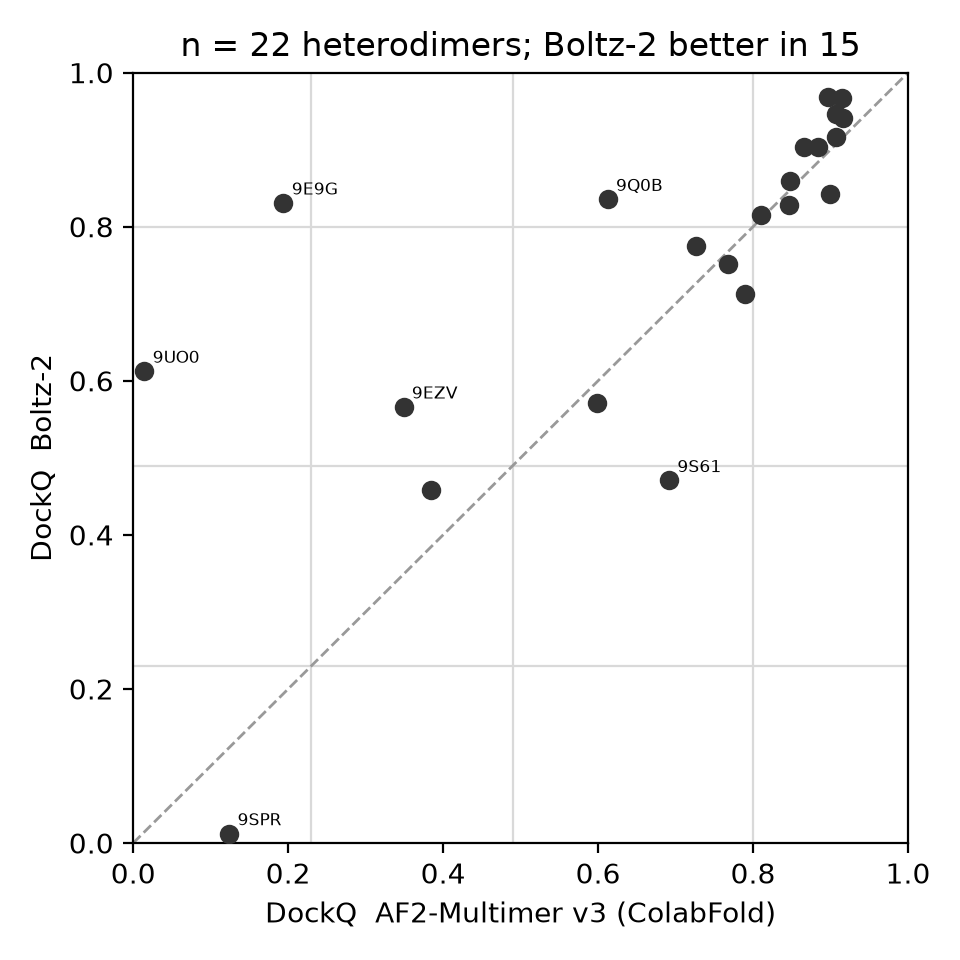
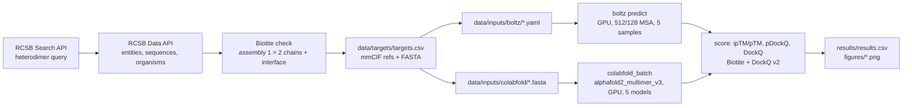

# cofold-bench

**Boltz-2 (cofolding) vs AlphaFold2-Multimer v3 (ColabFold) on post-training-cutoff protein–protein heterodimers**, scored with ipTM/pTM, pDockQ and DockQ against experimental PDB references. Structure handling with [Biotite](https://www.biotite-python.org/).

> **Status: complete — both predictors run on all 22 targets (2026-09-06/07, local RTX 4060 Laptop 8 GB).**
> All numbers below are regenerated by `python -m cofoldbench.score && python -m cofoldbench.report && python -m cofoldbench.plot`
> from the committed `results/results.csv`; the full tables are in [`results/report.md`](results/report.md).

## Results



**Headline.** On 22 heterodimers released after both models' training cutoffs, Boltz-2 and AlphaFold2-Multimer v3 are
close: median DockQ **0.83 vs 0.80**, Boltz-2 higher on 15 of 22 targets, but the paired difference is small and not
significant at this sample size (median ΔDockQ +0.02, Wilcoxon p = 0.16). Both predictors place 19 of 22 complexes at
CAPRI *acceptable* or better; Boltz-2 rescues two targets that AF2-Multimer gets wrong (9E9G, 9UO0) and no target goes
the other way. AF2-Multimer's confidence metrics track quality better than Boltz-2's (Spearman ρ(ipTM, DockQ) 0.79 vs 0.70;
ρ(pDockQ, DockQ) 0.86 vs 0.68).

| predictor | n | median DockQ | mean DockQ | acceptable+ (≥0.23) | medium+ (≥0.49) | high (≥0.80) | incorrect | ρ(ipTM, DockQ) | ρ(pDockQ, DockQ) |
|---|---|---|---|---|---|---|---|---|---|
| Boltz-2 (512/128 MSA, 5 samples) | 22 | 0.830 | 0.750 | 21 | 19 | 13 | 1 | 0.70 | 0.68 |
| AF2-Multimer v3 (ColabFold, 5 models) | 22 | 0.801 | 0.679 | 19 | 17 | 11 | 3 | 0.79 | 0.86 |

Per-target table: [`results/report.md`](results/report.md). Per-target bars: `figures/dockq_bars.png`.
Confidence vs quality: `figures/iptm_vs_dockq.png`.

**Failure cases (worth reading before trusting ipTM).**
* **9SPR** — p53 R282W core domain in complex with a designed binder (DARPin C10). Boltz-2 reports ipTM 0.81 but
  DockQ 0.01 (wrong interface); AF2-Multimer has ipTM 0.19 / DockQ 0.12 (also wrong, but *says so*). Designed binders
  have no co-evolutionary signal, so a confident cofolding answer here is a confident guess.
* **9E9G** — TGF-β mimic domain (parasite protein) with its receptor: AF2-Multimer ipTM 0.77 / DockQ 0.19 (confident
  failure); Boltz-2 0.87 / 0.83 (correct).
* **Antibody subset** (2 nanobody complexes, labelled separately): Boltz-2 medium quality on both (DockQ 0.57, 0.61);
  AF2-Multimer fails 9UO0 (0.01) and is acceptable on 9EZV (0.35). Two cases only — a direction, not a statistic.
* Both predictors are weakest on 9HMX (SteB–RipA, DockQ 0.46 / 0.38) and 9S61 (Aurora-A with a peptide-like
  partner, 0.47 / 0.69).

**MSA depth vs 8 GB of GPU memory (a practical result).** With Boltz-2's defaults (8192 MSA sequences loaded, 1024
subsampled) 15 of 22 targets ran out of memory on the 8 GB card regardless of length; the memory of the MSA module
scales with the number of *loaded* MSA sequences. The benchmark therefore uses `--max_msa_seqs 512 --num_subsampled_msa 128`
for every target (peak 3.8 GB on a 326-residue dimer). On the 7 targets that also completed with the defaults, the
truncation changed DockQ by +0.006 on average (max |Δ| 0.023) — see the side comparison in `results/report.md`
(`results/results_msa_default.csv`). Settings and the reasoning are recorded in `results/raw/boltz/SETTINGS.md`.

**Wall time on the laptop.** Boltz-2: median 2.0 min per target (22 targets in 52 min, MSAs from the ColabFold server).
AF2-Multimer via ColabFold: median 6.7 min per target with MSA retrieval, 3.3 min with cached MSAs; 5 models, 3 recycles.

## What / why

Cofolding models (AlphaFold3-class; here the open-weights **Boltz-2**) and the earlier **AlphaFold2-Multimer**
both predict complexes from sequence, but benchmarks usually reuse targets that overlap the training data.
This repository is a small, fully scripted benchmark on **protein–protein heterodimers released to the PDB
after 2024-06-01**, i.e. after the documented training cutoffs of both predictors, answering three questions:

1. Does Boltz-2 dock heterodimers better than AF2-Multimer v3 (DockQ, CAPRI classes) on unseen targets?
2. How well do the models' own confidences (ipTM, pDockQ) track the actual DockQ?
3. Are the failures shared (hard targets) or predictor-specific?

Everything — target selection, downloads, input generation, scoring, figures — is reproducible from
`config.yaml` with one command, and the data footprint is small (`data/` ≈ 13 MB).

## Pipeline



Stages of `run_all.sh`: `select | download | inputs | test | predict-boltz | predict-af2 | score | report`.
The two `predict-*` stages only run when the predictor is installed, a GPU is visible **and** `RUN_GPU=1` is set;
otherwise they print `SKIPPED`. `score` and `report` are no-ops (with a message) until predictions exist.

## Targets (22 = 16 primary + 4 backup + 2 antibody subset)

Selected on 2026-09-04 with the RCSB Search API (1023 hits for the raw query) and the Data API; the exact
JSON query, all filter thresholds and the per-stage counts are in [`data/targets/QUERY.md`](data/targets/QUERY.md);
every examined entry with its pass/fail reason is in `data/targets/candidates.csv`.

Criteria: exactly two protein polymer entities, one copy of each in the asymmetric unit, no nucleic acids;
X-ray or cryo-EM with resolution ≤ 2.8 Å (all 22 selected happen to be X-ray, 0.96–2.60 Å); canonical total
length 150–550 aa and each chain ≥ 40 aa (no peptides); released strictly after 2024-06-01; the two chains
are not (pseudo-)homodimers (different descriptions, global identity < 90 %); antibody-like entries (keywords
in title/descriptions **or** an Ig variable-domain sequence signature) go to a labelled `antibody` subset,
Fab/Fv heavy–light pairs without antigen are dropped; one entry per description pair; finally Biotite builds
biological assembly 1 and requires exactly two protein chains with ≥ 20 residue pairs within 5 Å.
Candidates are visited in a seeded random order (seed 2024) so the set is not biased toward the earliest deposits.

| # | PDB | role | chain A (entity 1) | chain B (entity 2) | len A+B | res. (Å) | released | organism(s) |
|---|---|---|---|---|---|---|---|---|
| 1 | [9ASS](https://www.rcsb.org/structure/9ASS) | primary | Neutrophil elastase | Extracellular Adherence Protein | 218+108=326 | 1.75 | 2024-06-12 | Homo sapiens / Staphylococcus aureus… |
| 2 | [8RO8](https://www.rcsb.org/structure/8RO8) | primary | Structural maintenance of chromosomes… | 64-kDa C-terminal product | 456+81=537 | 1.90 | 2024-09-11 | Homo sapiens |
| 3 | [9E9G](https://www.rcsb.org/structure/9E9G) | primary | TGF-beta receptor type-2 | Transforming growth factor beta mimic… | 118+92=210 | 1.40 | 2025-01-22 | Homo sapiens / Heligmosomoides polyg… |
| 4 | [9RS3](https://www.rcsb.org/structure/9RS3) | primary | N6-adenosine-methyltransferase cataly… | N(6)-adenosine-methyltransferase non-… | 228+307=535 | 2.11 | 2026-03-18 | Homo sapiens |
| 5 | [9YGS](https://www.rcsb.org/structure/9YGS) | primary | Isoform 2B of GTPase KRas | RAF proto-oncogene serine/threonine-p… | 171+80=251 | 1.68 | 2026-05-20 | Homo sapiens |
| 6 | [9IRO](https://www.rcsb.org/structure/9IRO) | primary | Uracil-DNA glycosylase | Staphylococcus epidermidis uracil-DNA… | 226+132=358 | 2.18 | 2025-07-16 | Staphylococcus aureus / Staphylococcus epider… |
| 7 | [9Q0B](https://www.rcsb.org/structure/9Q0B) | primary | Beta-lactamase CTX-M-15 | Beta-lactamase inhibitory protein | 261+164=425 | 1.58 | 2025-11-05 | Escherichia coli / Streptomyces clavulig… |
| 8 | [8CM0](https://www.rcsb.org/structure/8CM0) | primary | Immunity protein RhsI2 | Rhs-family protein | 162+162=324 | 2.17 | 2024-08-28 | Serratia marcescens |
| 9 | [9J9W](https://www.rcsb.org/structure/9J9W) | primary | TsiN | TseN | 158+156=314 | 2.60 | 2025-10-22 | Paracidovorax citrulli AAC00-1 |
| 10 | [9SPR](https://www.rcsb.org/structure/9SPR) | primary | Cellular tumor antigen p53 | DARPin C10 | 202+126=328 | 1.66 | 2026-04-22 | Homo sapiens / synthetic construct |
| 11 | [9FL4](https://www.rcsb.org/structure/9FL4) | primary | Methyltransferase N6AMT1 | Multifunctional methyltransferase sub… | 203+126=329 | 1.70 | 2025-06-18 | Homo sapiens |
| 12 | [9O24](https://www.rcsb.org/structure/9O24) | primary | Heparanase 50 kDa subunit | Heparanase 8 kDa subunit | 384+74=458 | 2.60 | 2026-02-11 | Homo sapiens |
| 13 | [9HPX](https://www.rcsb.org/structure/9HPX) | primary | Periplasmic [Fe] hydrogenase large su… | Periplasmic [Fe] hydrogenase small su… | 397+88=485 | 0.96 | 2025-12-24 | Desulfovibrio desulfuricans |
| 14 | [9I5Y](https://www.rcsb.org/structure/9I5Y) | primary | Endoplasmic reticulum chaperone BiP | Cerebral dopamine neurotrophic factor | 381+61=442 | 1.50 | 2026-02-18 | Homo sapiens |
| 15 | [9OHL](https://www.rcsb.org/structure/9OHL) | primary | rRNA N(6)-adenosine-methyltransferase… | Multifunctional methyltransferase sub… | 209+125=334 | 1.29 | 2025-06-11 | Homo sapiens |
| 16 | [9D5P](https://www.rcsb.org/structure/9D5P) | primary | Integrin-linked protein kinase | Alpha-parvin | 271+129=400 | 1.50 | 2025-10-29 | Homo sapiens |
| 17 | [9S61](https://www.rcsb.org/structure/9S61) | backup | DBL8 | Aurora kinase A | 62+285=347 | 2.37 | 2026-07-22 | synthetic construct / Homo sapiens |
| 18 | [9FWR](https://www.rcsb.org/structure/9FWR) | backup | Non-structural protein 10 | Guanine-N7 methyltransferase nsp14 | 131+290=421 | 2.29 | 2025-07-09 | Severe acute respiratory syndrome coronavirus 2 |
| 19 | [9G0D](https://www.rcsb.org/structure/9G0D) | backup | [F-actin]-monooxygenase MICAL1 | Ras-related protein Rab-10 | 153+177=330 | 2.05 | 2025-07-02 | Homo sapiens |
| 20 | [9HMX](https://www.rcsb.org/structure/9HMX) | backup | Peptidoglycan endopeptidase RipA | Copper transporter MctB | 216+277=493 | 2.22 | 2025-07-30 | Mycobacterium tuberculosis H37Rv |
| 21 | [9EZV](https://www.rcsb.org/structure/9EZV) | antibody subset | V-set and immunoglobulin domain-conta… | single-domain antibody VHH_h2 | 127+134=261 | 1.45 | 2025-10-29 | Homo sapiens |
| 22 | [9UO0](https://www.rcsb.org/structure/9UO0) | antibody subset | Spike glycoprotein | Tnb165 | 214+129=343 | 2.50 | 2026-04-29 | Middle East respirato… / Homo sapiens |

Chain `A`/`B` in the predictor inputs are entity 1/entity 2; the reference chain ids (label and author) are in
`targets.csv`. Two remarks: 9O24 is the 50 + 8 kDa heterodimer produced by proteolytic processing of one
heparanase precursor (a heterodimer in the PDB sense, but the two chains come from one gene), and 9FL4 / 9OHL
share the partner TRM112 with different methyltransferases.

## Cutoff rationale

| model | training data cutoff | source |
|---|---|---|
| AlphaFold-Multimer v3 (AlphaFold v2.3.0 weights, `alphafold2_multimer_v3` in ColabFold) | PDB entries released before **2021-09-30** | DeepMind, [`docs/technical_note_v2.3.0.md`](https://github.com/google-deepmind/alphafold/blob/main/docs/technical_note_v2.3.0.md): "a new training cutoff of 2021-09-30" |
| Boltz-2 | PDB entries released before **2023-06-01** (validation set: 2023-06-01 to 2024-01-01) | Passaro et al. 2025, bioRxiv [10.1101/2025.06.14.659707](https://doi.org/10.1101/2025.06.14.659707), *Data* section and Appendix ("every PDB structure up to the training date cutoff of 06/01/2023") |

We require initial release **after 2024-06-01**, six months later than the newest date in either paper, so no
target structure was available to either model during training. Caveat (not controllable at this scale): close
homologues of a target *complex* may exist before the cutoff; the ColabFold MSA server and Boltz-2's MSA are
built from current sequence databases in both cases, so the comparison is fair between the two predictors but is
not a "no-homology" benchmark.

## Metrics

* **ipTM / pTM / pLDDT** — read from the predictors' own confidence files. Boltz-2:
  `confidence_<id>_model_k.json` (`protein_iptm`, `iptm`, `ptm`, `complex_plddt`, `confidence_score` = 0.8·pLDDT + 0.2·ipTM,
  used for ranking). ColabFold: `<id>_scores_rank_00k_alphafold2_multimer_v3_model_m_seed_00s.json` (`iptm`, `ptm`,
  per-residue `plddt`; ranked by 0.8·ipTM + 0.2·pTM).
* **pDockQ** — Bryant, Pozzati & Elofsson, *Nat Commun* 13:1265 (2022):
  pDockQ = 0.724 / (1 + exp(−0.052 (x − 152.611))) + 0.018 with x = ⟨pLDDT⟩<sub>interface</sub> · log10(N<sub>contacts</sub>),
  contacts = CB–CB (CA for Gly) pairs < 8 Å between chains. Implemented in `src/cofoldbench/pdockq.py`,
  pLDDT taken from the model's B-factor column (both predictors write 0–100; Boltz 2.2.1's writer multiplies by 100 — a 0–1 scale would be auto-detected).
* **DockQ** — [DockQ v2](https://github.com/bjornwallner/DockQ) (Mirabello & Wallner 2024) via its Python API
  (`load_PDB`, `run_on_all_native_interfaces`), both chain assignments tried and the best kept (= automatic mapping
  for two chains); CAPRI classes acceptable ≥ 0.23, medium ≥ 0.49, high ≥ 0.80. The native is biological
  assembly 1 of the RCSB mmCIF, protein heavy atoms only, built with `biotite.structure.io.pdbx.get_assembly`.

Tests (`pytest`, 17 tests): pDockQ on synthetic coordinates (sigmoid limits, contact counting, interface-pLDDT
averaging, monotonicity, pLDDT-scale detection); Biotite assembly/chain/contact utilities on the downloaded references; **DockQ of each
reference against itself = 1.0** (also with swapped model chains); parsers on synthetic Boltz-2/ColabFold outputs; an end-to-end `score` + `plot` run on synthetic predictions built from three references (DockQ = 1.0 for both predictors, figures written).

## Reproduce

```bash
# 1. environments (see environment.yml; ColabFold lives in its own env because of jax/cuda pins)
mamba env create -f environment.yml                      # env "cofold": biotite 1.6.0, DockQ 2.1.3, pandas, matplotlib, boltz 2.2.1
mamba create -n colabfold python=3.10 -y && \
  ~/miniforge3/envs/colabfold/bin/pip install "colabfold[alphafold]" "jax[cuda12]"   # env "colabfold" (colabfold 1.6.2 here)

# 2. everything that runs without a GPU (idempotent; targets.csv is not re-selected unless FORCE_SELECT=1)
./run_all.sh select download inputs test

# 3. GPU predictions (resumable: finished targets are skipped)
RUN_GPU=1 ./run_all.sh predict-boltz predict-af2        # or scripts/run_boltz.sh 9ASS / scripts/run_colabfold.sh 9ASS
./run_all.sh score report                               # results/results.csv, figures/*.png
```

Predictor settings (all in `config.yaml`): Boltz-2 `--recycling_steps 3 --diffusion_samples 5 --sampling_steps 200
--use_msa_server --msa_pairing_strategy greedy --output_format mmcif --seed 42` (potentials off);
ColabFold `--model-type alphafold2_multimer_v3 --num-recycle 3 --num-models 5 --num-seeds 1 --msa-mode mmseqs2_uniref_env
--pair-mode unpaired_paired --rank multimer` (no Amber relax). Both scripts skip finished targets
(Boltz: `confidence_<id>_model_0.json` present; ColabFold: `<id>.done.txt`) and log to `results/raw/*/logs/`.

## Hardware and run history

Local laptop: NVIDIA GeForce RTX 4060 Laptop GPU (8 GB), AMD Ryzen 7 8845HS (16 threads), 14 GB RAM, driver 560 / CUDA 12.6.
Environments: `cofold` (boltz 2.2.1, torch 2.7.1+cu126, biotite 1.6.0, DockQ 2.1.3) and `colabfold` (colabfold 1.6.2, jax 0.6.2
with CUDA 12.6 pip libraries and cuDNN 9.8). What it took to get both predictors running on this card, in case it saves someone a day:

* Boltz-2 runs with `--no_kernels`: the optional cuEquivariance kernels could not be installed on driver 560 without pip
  replacing torch with a CUDA 13 build. The plain PyTorch path is numerically equivalent and roughly 1.5–2× slower.
* Boltz-2 defaults OOM on 15/22 targets → uniform `--max_msa_seqs 512 --num_subsampled_msa 128` (see Results).
* ColabFold's `jax[cuda12]` needed `nvidia-cudnn-cu12==9.8.*` (the first pass failed with "DNN library initialization failed")
  and CUDA-12.6-series NVIDIA pip libraries to match the driver; the MSAs from the first pass were cached and reused.
* The laptop hard-reset twice under sustained GPU+CPU load; runs are resumable (finished targets are skipped) and
  GPU temperature/power were logged during the final run (peak ~70 °C, ~60 W).

## Data provenance

* Structures and metadata: RCSB PDB ([Search API](https://search.rcsb.org/), [Data API](https://data.rcsb.org/),
  [files.rcsb.org](https://files.rcsb.org/)), retrieved 2026-09-04; `data/targets/cif/*.cif` are the unmodified
  RCSB mmCIF files (13 MB in total). Sequences in `data/targets/fasta` are the canonical entity sequences
  (`entity_poly.pdbx_seq_one_letter_code_can`), which may include expression tags (e.g. His-tags) present in the construct.
* MSAs come from the public ColabFold MMseqs2 server (`api.colabfold.com`) for both predictors (retrieved 2026-09-06).
* Raw prediction outputs are not committed (`results/raw/` is git-ignored); the aggregated CSVs (`results/results.csv`,
  `results/summary.csv`, `results/results_msa_default.csv`), `results/report.md` and the figures are.

## Limitations

* **22 targets is small.** Per-target differences of a few DockQ units are noise; the Boltz-2 vs AF2-Multimer difference
  is not significant (Wilcoxon p = 0.16). The set is X-ray only and enriched in enzyme–inhibitor and signalling complexes.
* **Boltz-2 ran with a truncated MSA (512/128)** because of the 8 GB card; on 7 targets this changed DockQ by ≤0.023, but the
  comparison is against AF2-Multimer with full ColabFold MSAs, so a small systematic disadvantage for Boltz-2 cannot be excluded.
* "Post-cutoff" refers to the *structures*; homologous complexes may pre-date the cutoff (see above).
* Single seed / 5 models per predictor; ranking by each predictor's own confidence. Boltz-2 is run without
  inference-time potentials (`use_potentials: false`) to compare the raw models.
* The reference is biological assembly 1 as annotated by the depositors; for all 22 targets it equals the asymmetric unit (checked with Biotite: same chains and residue counts).
* Antibody–antigen complexes are a known-hard, separate class: only two are kept, clearly labelled, and are reported separately.

## Layout

```
config.yaml              all parameters (selection thresholds, predictor flags, pDockQ constants)
run_all.sh               single entry point with guarded stages
src/cofoldbench/         rcsb, select_targets, download, make_inputs, structure, pdockq, confidence, dockq_runner, score, plot
scripts/run_boltz.sh     Boltz-2 driver (resume-safe)          scripts/run_colabfold.sh   AF2-Multimer driver (resume-safe)
data/targets/            QUERY.md, targets.csv, candidates.csv, cif/, fasta/
data/inputs/             boltz/*.yaml, colabfold/*.fasta
tests/                   pytest suite (17 tests)
results/, figures/       aggregated CSVs, report.md, figures (committed)
```

## Citation

If you use this benchmark, please cite the tools it builds on:
Passaro et al., *Boltz-2* (bioRxiv 2025, 10.1101/2025.06.14.659707); Evans et al., *AlphaFold-Multimer*
(bioRxiv 2021, 10.1101/2021.10.04.463034); Mirdita et al., *ColabFold* (Nat Methods 2022); Bryant et al.,
pDockQ (Nat Commun 2022); Mirabello & Wallner, *DockQ v2* (Bioinformatics 2024); Kunzmann & Hamacher,
*Biotite* (BMC Bioinformatics 2018).

```
Shovkoplias O. (2026). cofold-bench: Boltz-2 vs AlphaFold2-Multimer on post-cutoff protein heterodimers.
https://github.com/oshovkoplias/cofold-bench (MIT)
```
